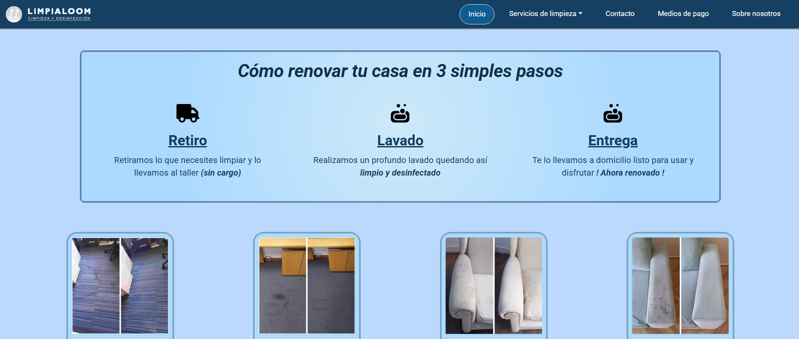

## Limpialoom Web

Limpialoom Web es un sitio web desarrollado para un emprendimiento de limpieza especializado en sillones, alfombras, colchones y cortinas.

El proyecto fue diseñado con un enfoque moderno, visual y responsive, buscando transmitir una imagen profesional del servicio y facilitar el acceso a la información para potenciales clientes.

## Preview

## Demo

🌐 https://limpialoom.vercel.app/

## Características

- Diseño responsive para distintos dispositivos
- Landing page moderna y minimalista
- Navegación simple e intuitiva
- Secciones informativas de servicios
- Uso de Bootstrap para maquetado responsive
- Estilos personalizados con CSS
- Deploy online con Vercel

## Tecnologías utilizadas

- HTML5
- CSS3
- Bootstrap 5

## Librerías y herramientas

- Bootstrap Icons
- Google Fonts
- Vercel
